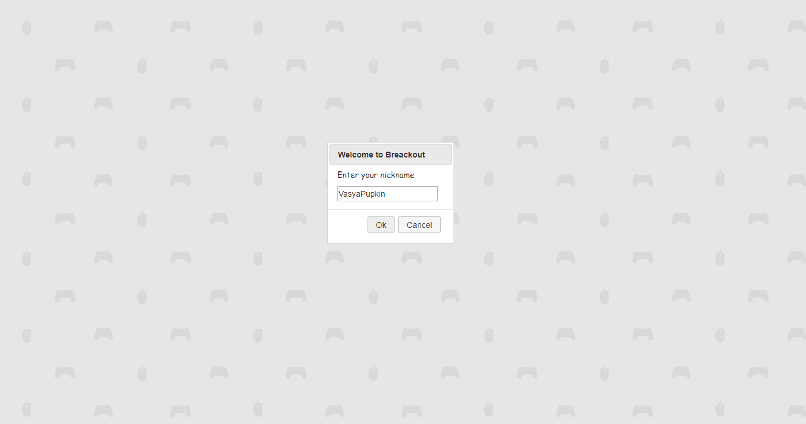
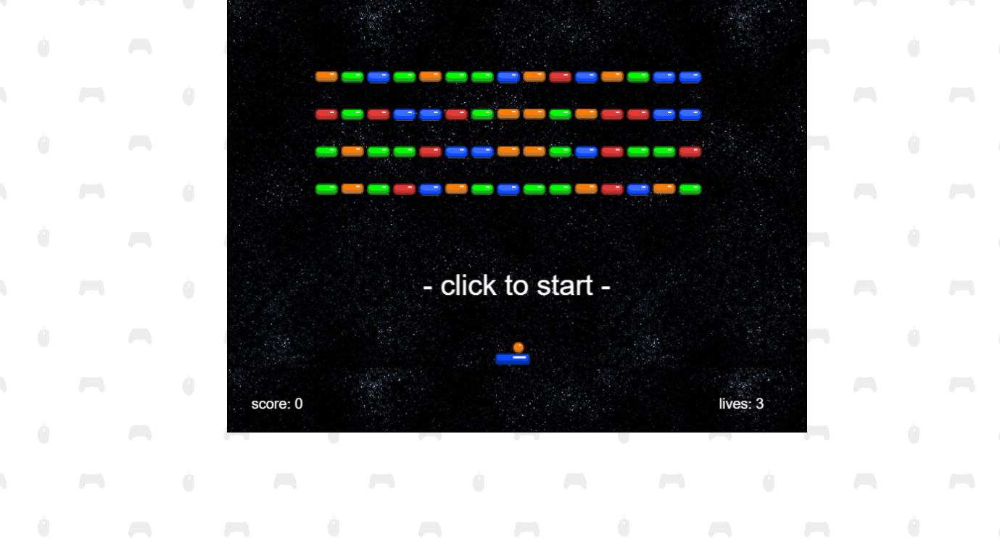
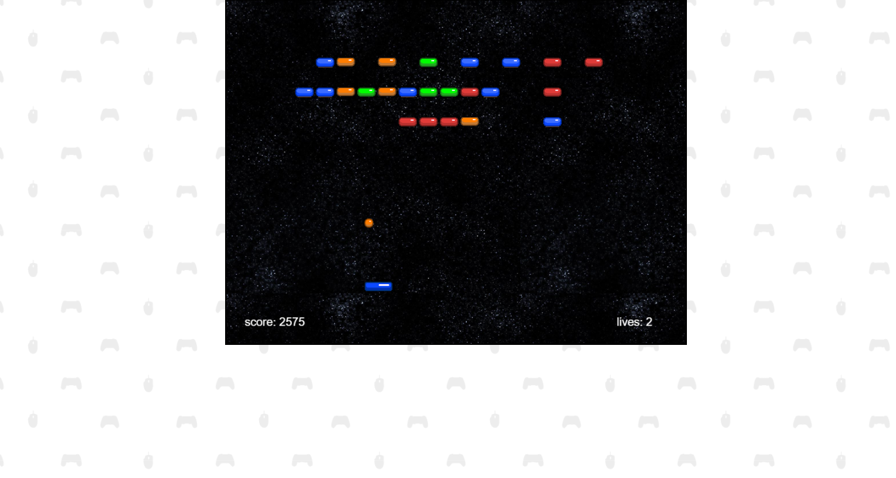
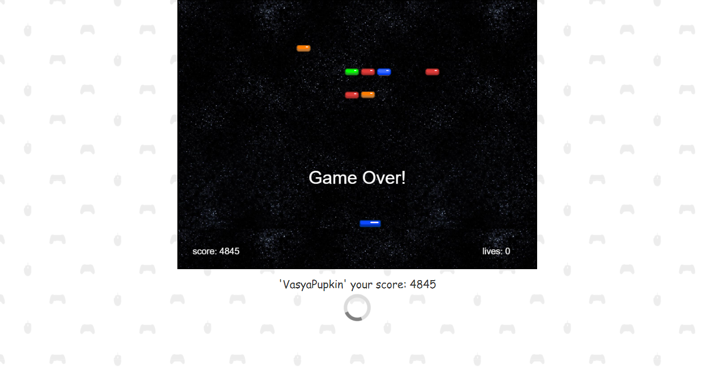
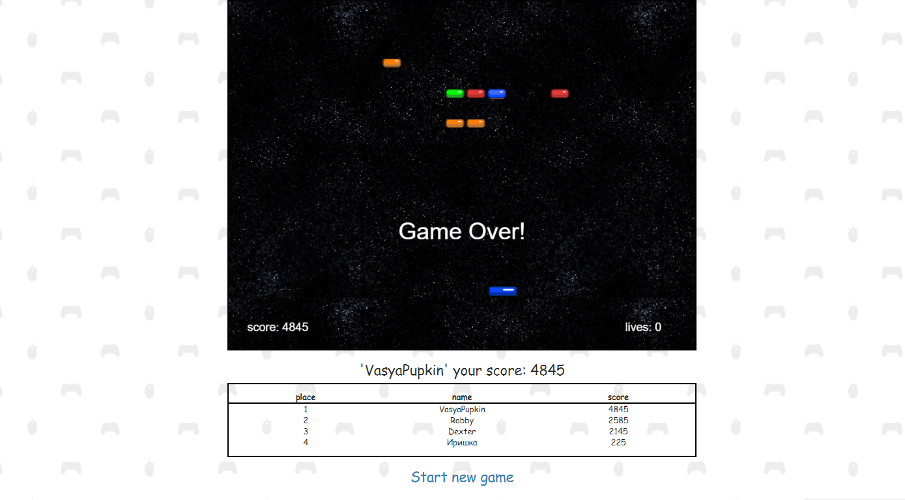

**Web-site**

https://jay-breackout.000webhostapp.com

**О приложении**

Браузерная игра, один игрок. Суть - набрать больше очков. Сбивая мячом кирпичи цветные.Каждый кирпич в зависимости от цвета дает очки( от 10 - 25), если это мигающий кирпич, которых может быть от 0 до 4, то за него дается 2000 очков. И после каждого раунда автоматом прибавляется 1000 очков.

После окончания игры (&quot;Game over&quot;), данные: имя игрока и набранные очки сохраняются в базу данных и выводятся с помощью ajax отдельным представлением - табличкой результатов.

**Front end** : Игровая логика, с использованием js движка **Phaser**

**Back end** : БД для хранения данных **MySQL** и **PHP** фреймворк **CodeIgniter,** для выполнения **CRUD** операций.

##
**Технологии и языки программирования**

- Html/CSS(Bootstrap)
- JavaScript(phaser framework, jQuery),
- PHP(CodeIgniter framework);
- MySQL

## 
**Screenshots**

# 

# 

# 

# 

